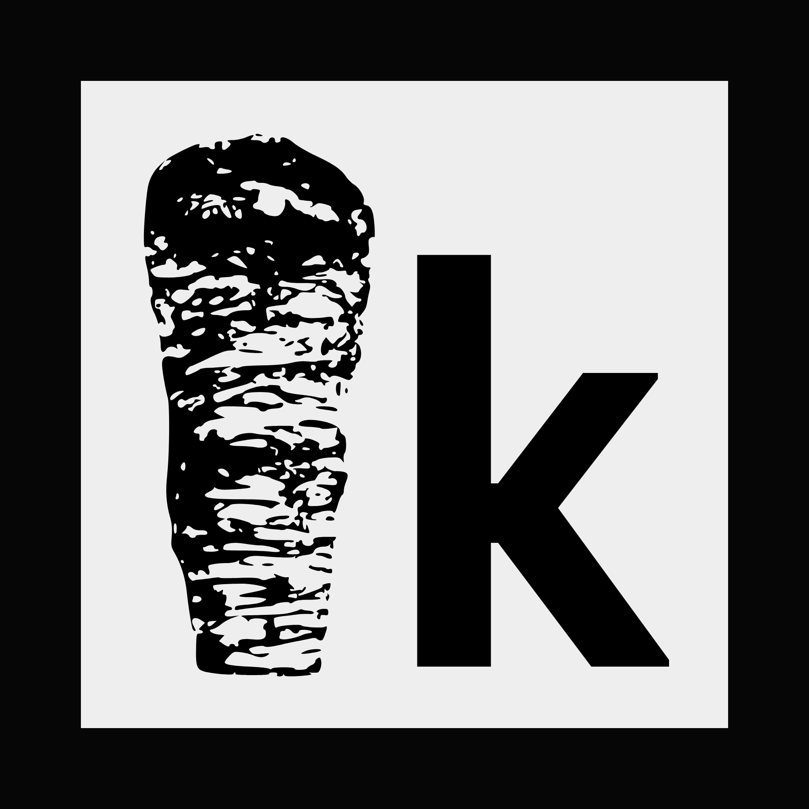

<div align="center">
  <a href="https://kebabos.me"></a>
<h1>kebabOS CLI - v0.3.0</h1>
  <b>A high-performance, command-line operating system built in Python Pygame. Features bash-like command shell and custom kernel.</b>
</div>

---

## Features

- Custom kernel: Custom made kernel, as the core for the cli.
- User settings, for customisation (including theme colours, font size and line spacing)
- Hard-coded and os commands
- Curl built in

## Docs

**Read the docs [in this repo](docs), or read the full kebab-os documentation on the [website](https://docs.kebabos.me)**.

### User Guide

Read the [user guide](docs/USER_GUIDE.md), for a simple explaination on the basics of kebab-cli. Or skip straight to the [install guide](install/README.md).

## Quick Setup

### Windows (PowerShell)
```powershell
cd ~
if (!(Test-Path .kebab)) { mkdir .kebab }
cd .kebab
curl.exe -L https://github.com/kebab-os/kebab-cli/archive/refs/heads/main.zip -o kebab-cli.zip
Expand-Archive -Path kebab-cli.zip -DestinationPath . -Force
cd kebab-cli/src
```

### Linux (bash)
```bash
cd ~
mkdir .kebab
cd .kebab
git clone https://github.com/kebab-os/kebab-cli.git
cd kebab-cli/src
sudo apt-get install xclip  # Debian/Ubuntu
# For other distros:
# sudo pacman -S xclip      # Arch
# sudo dnf install xclip    # Fedora
```

### macOS (bash)
```bash
cd ~
mkdir .kebab
cd .kebab
git clone https://github.com/kebab-os/kebab-cli.git
cd kebab-cli/src
# Ensure Xcode command line tools are installed:
# xcode-select --install
```

When you have installed kebab-cli, boot it using:

```bash
python main.py
```


## License

kebabOS is under the [MIT License](LICENSE).

<br /><br />
<hr/>

<div align="right">
<sub>
  &copy; kebab 2026
</sub>
</div>
